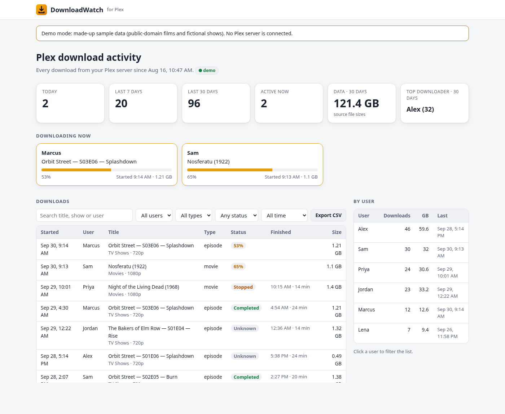
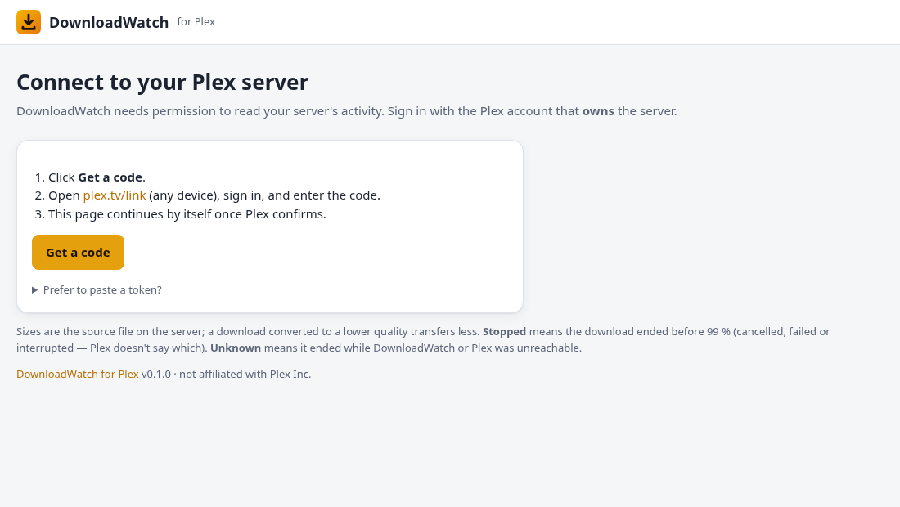

# DownloadWatch for Plex

**A permanent history of who downloaded what from your Plex server.**

Plex shows a download (the **Download** button in the Plex apps, for offline viewing) only while it is running. Once it finishes, it's gone: there is no log of who downloaded which movie or episode, or when. DownloadWatch listens to your Plex Media Server and records every download the moment it starts, then gives you a dashboard to review them.



- **Live:** downloads in progress appear at the top with a progress bar.
- **History:** every download with user, title (show, season and episode for TV), start and finish time, status and file size, kept for as long as you like.
- **Search and filters:** by user, title, type, status and date range (today, 7 days, 30 days, this month, custom).
- **Per-user totals**, a detail view for each download, and **CSV export** of whatever you have filtered.
- **Easy setup:** sign in with a code at plex.tv/link; no digging for tokens.
- **Runs where you are:** Docker (PC, NAS, Raspberry Pi) or a Windows installer, no Docker needed.
- **Small and self-contained:** one container (~70 MB) or an 11 MB Windows zip, Python standard library only, a single SQLite file. Light and dark themes.

> Not affiliated with or endorsed by Plex Inc. "Plex" is a trademark of Plex Inc.

## Try it in 30 seconds (demo, no Plex needed)

```bash
docker run --rm -p 8090:8090 -e DEMO=true ghcr.io/fahillion/downloadwatch:latest
```

Open http://localhost:8090. Demo mode uses made-up users, public-domain films and fictional shows, with simulated downloads in progress.

## Install on Windows (no Docker)

For PCs that only run Windows (10/11 or Server 2016+, 64-bit). Everything is included: the official Python from python.org and the app. No separate installs.

1. Download `DownloadWatch-<version>-windows-x64.zip` from the [latest release](https://github.com/fahillion/downloadwatch/releases/latest). Right-click it, choose **Properties**, tick **Unblock**, then unzip it.
2. *(Optional)* Double-click **Try-Demo.cmd** to see it with made-up data.
3. Open **PowerShell as Administrator** in the unzipped folder and run:

   ```powershell
   powershell -ExecutionPolicy Bypass -File .\Install-DownloadWatch.ps1
   ```

   It asks for your Plex server's address, your time zone and a dashboard password. Then it installs to `C:\Program Files\DownloadWatch`, keeps settings and history in `C:\ProgramData\DownloadWatch` (readable only by Administrators and SYSTEM), starts DownloadWatch at boot as a background Scheduled Task, and allows port 8090 through Windows Firewall on private networks.
4. Open the address it prints, log in, click **Get a code**, and enter it at [plex.tv/link](https://plex.tv/link).

To upgrade, run the new version's installer (it keeps your settings and history). To remove it, run `C:\Program Files\DownloadWatch\Uninstall-DownloadWatch.ps1` (add `-RemoveData` to delete the history too). `README-Windows.txt` in the zip has the details.

## Install with Docker

You need Docker on any always-on machine on the same network as your Plex server (it does **not** have to be the Plex machine), and the Plex account that **owns** the server.

1. Get the files:

   ```bash
   mkdir downloadwatch && cd downloadwatch
   curl -fsSLO https://raw.githubusercontent.com/fahillion/downloadwatch/main/docker-compose.yml
   curl -fsSL https://raw.githubusercontent.com/fahillion/downloadwatch/main/.env.example -o .env
   ```

2. Edit `.env`: set `PLEX_URL` to your server's LAN address (for example `http://192.168.1.10:32400`), choose an `AUTH_PASSWORD`, and set your `TIMEZONE`.

3. Start it:

   ```bash
   docker compose up -d
   ```

4. Open `http://<this-machine>:8090`, log in with `admin` and your password, click **Get a code**, and enter the code at [plex.tv/link](https://plex.tv/link). The dashboard appears as soon as Plex confirms.



From then on, every download is recorded. Try one from a phone to see it appear.

> **Bind-mounted `./data` and permissions:** the container runs as user and group 1000. If your Docker host's `./data` folder is owned by someone else, run `sudo chown -R 1000:1000 data`, or use a named volume.

### Updating

```bash
docker compose pull && docker compose up -d
```

Your history lives in `./data/downloads.db` and survives updates.

## Settings

All settings are environment variables (put them in `.env`).

| Variable | Default | What it does |
| --- | --- | --- |
| `PLEX_URL` | *(required)* | Your Plex server, e.g. `http://192.168.1.10:32400`. Use the LAN address. |
| `AUTH_PASSWORD` | *(none)* | Dashboard password (HTTP Basic login). **Strongly recommended**: without it anyone who can reach the port sees the history. |
| `AUTH_USERNAME` | `admin` | Dashboard user name. |
| `AUTH_PASSWORD_FILE` | | Read the password from a file instead (Docker secrets). |
| `AUTH_DISABLED` | `false` | Set `true` only if a reverse proxy in front already requires a login. |
| `TIMEZONE` | `TZ` or `UTC` | Time zone for the dashboard and CSV, e.g. `Europe/London`. |
| `PLEX_TOKEN` | | Use this Plex token instead of signing in on the dashboard. |
| `POLL_INTERVAL_SECONDS` | `5` | Backstop check interval (the live feed is the main source). |
| `PORT` | `8090` | Web port inside the container. |
| `NAV_LINKS` | | Links for the top bar: `Label=URL,Label=URL` (http(s) or `/path` only). |
| `SITE_TITLE` | `DownloadWatch` | Name in the header. |
| `DATA_DIR` | `/data` | Where the database, saved token and snapshots go. |
| `SNAPSHOT` | `true` | Write a consistent copy of the database to `data/snapshot/` daily at 01:30 (for backups). |
| `LOG_FILE` | | Also log to this file (rotated, 5 × 5 MB). Logs always go to stdout. |
| `DEBUG_PLEX_ACTIVITY` | `false` | Log raw download activity from Plex (token removed), for troubleshooting. |
| `DEMO` | `false` | Sample data, no Plex connection. |
| `HOST` | `0.0.0.0` | Address to listen on (`127.0.0.1` = this machine only). |

## How it works

DownloadWatch talks to your Plex Media Server over its normal HTTP API. It does not modify Plex, sniff network traffic, or need to run on the Plex machine.

- **Live feed:** it keeps a connection open to Plex's notification stream (`/:/eventsource/notifications`). Plex announces each download as an activity of type `media.download` when it **starts**, sends **progress updates**, and announces when it **ends**.
- **Backstop:** every 5 seconds it also asks `/activities` directly, in case the live connection dropped.
- **Details:** it looks up the title, year, show/season/episode, library and file size (`/library/metadata`), and user names (`/accounts`), and caches them.
- **One record per download:** each Plex activity has a unique ID, so progress updates change the same record rather than adding new ones.

### What the statuses mean

| Status | Meaning |
| --- | --- |
| **Active** | Downloading now. |
| **Completed** | Plex ended it at 99 % or more. |
| **Stopped** | Plex ended it below 99 %: cancelled, failed or interrupted (Plex doesn't say which). |
| **Unknown** | It disappeared while DownloadWatch or Plex was offline, before it reached 99 %. |

DownloadWatch never marks a download completed without evidence.

## Limitations

- **History starts when you install it.** Plex keeps no record of past downloads, so there is nothing to import.
- **No device name.** Plex leaves the device out of download activities. The user is always recorded.
- **Sizes are the source file.** If the download was converted to a lower quality, less data was actually transferred.
- **Server owner only.** Sign in with the account that owns the server; DownloadWatch refuses other accounts, because it needs to see everyone's activity.
- **Tested on** Plex Media Server 1.43 (Windows). Reports from other versions and platforms are very welcome; please open an issue.

## Privacy

The history records what named people downloaded from your server. Treat it like any other log about your users: set a dashboard password, keep it on your LAN or behind a login, and consider telling the people you share with.

DownloadWatch stores its Plex token in `data/plex_token` (file mode 0600). It sends the token only to your Plex server and plex.tv, only in request headers, and never logs it or shows it on the dashboard. Nothing is sent anywhere else, and there is no telemetry.

## Without Docker

Needs Python 3.10 or newer; no packages to install.

```bash
sudo useradd --system --home /var/lib/downloadwatch downloadwatch
sudo git clone https://github.com/fahillion/downloadwatch /opt/downloadwatch
sudo cp /opt/downloadwatch/.env.example /etc/downloadwatch.env   # edit it; set TIMEZONE
sudo chmod 600 /etc/downloadwatch.env
sudo cp /opt/downloadwatch/deploy/downloadwatch.service /etc/systemd/system/
sudo systemctl daemon-reload && sudo systemctl enable --now downloadwatch
```

Or just run it: `PLEX_URL=http://192.168.1.10:32400 DATA_DIR=./data python3 app/downloadwatch.py`

On macOS, install Python 3.10+ and run the same command. On Windows, use the Windows zip above, or install Python 3.10+ plus `pip install tzdata` (Windows has no built-in time zone database).

Settings can also come from a file of `KEY=VALUE` lines: `python3 app/downloadwatch.py --config /etc/downloadwatch.env` (environment variables take precedence).

## Troubleshooting

- **Logs:** `docker compose logs -f downloadwatch`.
- **"Plex unreachable":** check `PLEX_URL` from the DownloadWatch machine: `curl http://192.168.1.10:32400/identity` should return XML.
- **"Plex rejected the token":** click **Sign in again** on the dashboard (it appears when a password is set), or replace `PLEX_TOKEN`.
- **"This Plex account does not own the server":** sign in at plex.tv/link with the owner's account.
- **A download didn't show up:** make sure it was a *download* (for offline viewing), not streaming. Set `DEBUG_PLEX_ACTIVITY=true`, try again, and include the log lines in an issue (the token is removed automatically).
- **Health check:** `http://<host>:8090/health` (no login) returns `"status": "ok"` when connected. Useful for Uptime Kuma and similar tools (look for the keyword `downloadwatch healthy`).
- **Backups:** back up the `data/` folder. `data/snapshot/downloads.db` is a consistent daily copy.

## API

Everything the dashboard shows is available as JSON (same login): `GET /api/summary`, `GET /api/downloads?user=&type=&status=&q=&from=YYYY-MM-DD&to=YYYY-MM-DD&limit=&offset=`, `GET /api/downloads/<id>`, `GET /api/export.csv?<same filters>`.

## Development

```bash
python3 -m unittest discover -s tests -v     # no dependencies
DEMO=true DATA_DIR=./data python3 app/downloadwatch.py
docker build -t downloadwatch:dev .
```

Issues and pull requests are welcome. Please keep it dependency-free.

## License

[MIT](LICENSE)
